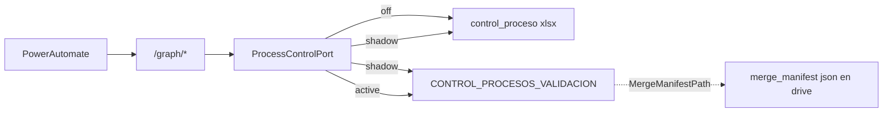

# Plan: Lista SharePoint solo para control_proceso_*

## Alcance (acotado)

**Incluye:** los 2 Excel técnicos
`control_proceso_validacion_pagos_banco_bogota.xlsx` y
`…_bancolombia.xlsx` → una lista `CONTROL_PROCESOS_VALIDACION`.

**Objetivo ops:** editar estado (`EstadoProceso`, `IsActive`, etc.), unlock tras error de API, búsqueda por `ProcessKey` — sin pelearse con hoja Excel protegida ni riesgo de borrar el archivo.

**Excluye explícitamente:**

- `merge_manifest_*.json` (queda en drive; se puede retomar después)
- Excel de Generate/Finalize/revisión, `BANCO_*`, `CORREOS`, `IBR`, adelantados, amortización, PDFs

## Decisiones fijadas

- **Corte:** `PROCESS_CONTROL_LIST_MODE=off|shadow|active` (patrón extract-index). Default: `off`.
- **Una lista** (no una por banco): filtro `ENVIRONMENT` + `BankCode`; `ProcessKey` indexado.
- **Semántica:** al cambiar `ProcessKey` (nuevo día/lote) archivar ítem anterior (`IsActive=false`) y activar el nuevo. Unlock = filtrar por `ProcessKey` y patch de campos.
- **Admin crea la lista** a mano; API solo CRUD de ítems + validación de esquema (sin `create_list`).
- **PA intacto:** mismos `/graph/`*; solo cambia el almacén detrás del puerto de control.
- Columna `MergeManifestPath` **sigue existiendo** en el ítem de control y apunta al JSON en drive (sin migrar el manifest).

## Por qué encaja

Control = máquina de estados + paths + idempotencia, hoy en Excel protegido vía
`[payment_validation_process_control.py](app/application/use_cases/payment_validation_process_control.py)`
(~18 writes / ~20 reads). Lista = misma fila lógica, editable y buscable.

## Fase 0 — Prep admin (sandbox)

Crear lista `**CONTROL_PROCESOS_VALIDACION**` con columnas alineadas a
`[PROCESS_CONTROL_COLUMNS](app/application/use_cases/setup_merge_control_workbook.py)` más:

- `ENVIRONMENT` (texto indexado, required)
- `BankCode` (texto indexado, required)
- `ProcessKey` (texto indexado)
- `IsActive` (sí/no)
- Resto: estado, paths, claves idempotencia, job ids, `ExecutionId`, `ExecutionLogPath`

Checklist de columnas tipo `column_specs`; API valida, no crea el contenedor.

## Fase 1 — Puerto + repo (modo `off`)

- Specs/settings/repo al estilo extract-index bajo `app/application/services/process_control_list/`
- `GraphProcessControlRepository`: get_active(bank), get_by_process_key, upsert/archive, patch fields
- Adapter: `off` Excel only; `shadow` dual-write + lectura Excel + log diffs; `active` lista como fuente de verdad
- Integración única: `read_process_control_snapshot` / `update_process_control_row2` (+ UI `read_process_control`)
- Tests con fake Graph: modes, aislamiento `ENVIRONMENT`, archive `IsActive`

## Fase 2 — Seed + shadow sandbox

- Seed desde los 2 Excel → ítems activos Bogotá/Bancolombia (`ENVIRONMENT=sandbox`)
- `PROCESS_CONTROL_LIST_MODE=shadow`
- Smoke lectura UI + updates de estado; comparar Excel vs lista
- Probar unlock manual en lista (solo impacto pleno al pasar a `active`)

## Fase 3 — `active` sandbox

- `PROCESS_CONTROL_LIST_MODE=active`
- Dejar de escribir Excel de control (evitar doble fuente)
- Conservar xlsx en SharePoint como respaldo; no borrar en el primer deploy
- Validar unlock + pipeline Generate→Apply + UI
- Prod solo tras sandbox estable (mismo flag, filtro `ENVIRONMENT=production`)

## Fuera de alcance

- Migrar `merge_manifest_*.json` a lista
- Migrar Excel operativos (revisión, bancos, CORREOS, etc.)
- `create_list` desde API
- Push/merge a `develop` / corte prod sin validación sandbox
- UI propia de unlock (al inicio basta editar la lista en SharePoint)

## Riesgos

| Riesgo                   | Mitigación                                                   |
| ------------------------ | ------------------------------------------------------------ |
| Doble fuente Excel+lista | Solo `shadow` dual-write; `active` single source             |
| Schema incompleto        | Fail-closed validate_schema                                  |
| Throttling Graph         | Reusar retries `list_http`                                   |
| Unlock incorrecto        | Indexar `ProcessKey`; no borrar ítems, solo `IsActive=false` |

## Criterio de éxito

1. `off`: comportamiento idéntico (Excel).
2. `shadow` sandbox: dual-write sin romper PA; diffs logueados.
3. `active` sandbox: unlock por lista (`EstadoProceso` / `IsActive` / búsqueda `ProcessKey`); pipeline y UI OK.
4. Manifest sigue siendo JSON en drive; columna `MergeManifestPath` sigue funcionando.

