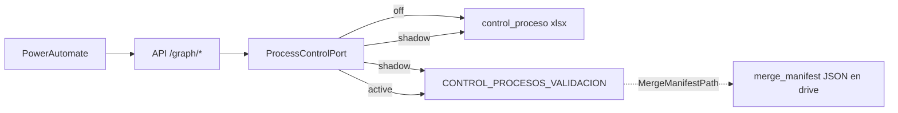

# Plan: Lista SharePoint para `control_proceso_*` (solo control técnico)

> **Nota v3 (2026-08):** extract-index eliminado del runtime (sin EXTRACT_INDEX_* ni /extract-index/admin). Workbook operador = Aplicacion_Pagos / _Meta (no Distribucion_* / Casos_Pago). Este plan es histórico de la fase UI.


**Fecha:** 2026-07-30  
**Worktree / rama de trabajo:** `wt-integration-performance-and-ui` / `integration/performance-and-ui`  
**Estado:** PAUSADO (2026-07-30) — no implementar por ahora; control sigue en Excel  
**Audiencia:** revisión externa (ChatGPT / arquitectura)

---

## 1. Resumen ejecutivo

Migrar **únicamente** el estado técnico de los dos Excel de control de proceso:

- `control_proceso_validacion_pagos_banco_bogota.xlsx`
- `control_proceso_validacion_pagos_banco_bancolombia.xlsx`

…hacia **una lista SharePoint** admin-creada (`CONTROL_PROCESOS_VALIDACION`), con modos de corte `off | shadow | active` (mismo patrón que el índice de extractos).

**Objetivo de negocio / ops**

- Editar estado fácilmente (`EstadoProceso`, `IsActive`, claves de idempotencia, etc.).
- **Unlock** tras error de API sin pelearse con hoja Excel protegida.
- Buscar por `ProcessKey` / ID.
- Evitar que un usuario borre “el archivo” de control en el explorador de documentos.

**No se migra en este plan**

- Excel de Generate / Finalize / revisión (`validacion_pagos_*`).
- `BANCO_*.xlsx`, `CORREOS.xlsx`, `IBR_DIARIO.xlsx`, `pagos_adelantados.xlsx`.
- Tablas de amortización, PDFs EXTRACTOS/ASIENTOS.
- `merge_manifest_*.json` (permanecen en drive; la columna `MergeManifestPath` del control sigue apuntando al JSON).

Power Automate **no cambia de contrato**: mismos endpoints `/graph/*`. Solo cambia el almacén interno detrás del puerto de control del API.

---

## 2. Contexto actual

### 2.1 Ubicación SharePoint

Sitio Operaciones · Documentos · bajo `02 VALIDACION PAGOS`:

```text
90 ACCESO RESTRINGIDO/
└── 03 CONTROL TECNICO/
    ├── control_proceso_validacion_pagos_banco_bogota.xlsx
    └── control_proceso_validacion_pagos_banco_bancolombia.xlsx
```

Hoja `Procesos`, tabla `tblControlProcesosPagos`, **fila 2 = proceso activo** (se sobrescribe).

### 2.2 Contrato de columnas (Excel → candidatos a campos de lista)

Fuente: `PROCESS_CONTROL_COLUMNS` en `app/application/use_cases/setup_merge_control_workbook.py`.

| Grupo | Columnas |
|-------|----------|
| Estado / control | `Title`, `EstadoProceso`, `IsActive`, `CreatedAtProceso`, `LastUpdatedAtProceso`, `LastErrorUserMessage`, `LastErrorNextAction`, `LastCompletedStep`, `LastStepStatus`, `LastStepErrorCode` |
| Identidad | `ProcessKey`, `ProcessDate`, `BankCode`, `BankName`, `ProcessId` |
| Paths | `ValidationFilePath`, `HistoricalFilePath`, `SecretaryFilePath`, `EmailPdfPath`, `MergeManifestPath`, `ExecutionLogPath` |
| Idempotencia | `GenerateIdempotencyKey`, `FinalizeIdempotencyKey`, `NotifyIdempotencyKey`, `MergeIdempotencyKey`, `ApplyIdempotencyKey` |
| Jobs / merge counts | `GenerateJobId`, `FinalizeJobId`, `NotifyJobId`, `MergeJobId`, `ApplyJobId`, `MergeOutputCount`, `MergeSkippedCount`, `ExecutionId` |

### 2.3 Uso en código

Módulo canónico: `app/application/use_cases/payment_validation_process_control.py`

- Lectura: `read_process_control_snapshot` / `parse_process_control_row2`
- Escritura: `update_process_control_row2` (~18 call sites en Generate → Finalize → Notify → Merge → dry-run → Apply + hooks de execution log)
- UI: `app/adapters/secondary/ui_sharepoint_read.py` (`read_process_control`)

Hoy: descargar `.xlsx` → openpyxl → (opcional) reescribir workbook completo a Graph. La hoja está **protegida** a propósito (setup), lo que dificulta el unlock manual.

### 2.4 Listas técnicas SharePoint (contexto)

Historicamente el proyecto exploró listas INDICE_EXTRACTOS /
CONTROL_INDICE_EXTRACTOS (extract-index). **Ese runtime fue eliminado.**
El patrón útil que permanece: listas técnicas creadas a mano (Graph no
create_list), columna ENVIRONMENT, CRUD de ítems + schema fail-closed.
Este plan de control de proceso puede reutilizar ese patrón de lista, no el
código extract-index.


---

## 3. Diseño propuesto

### 3.1 Una lista, dos bancos

**Nombre display:** `CONTROL_PROCESOS_VALIDACION`

No una lista por banco. Filtros:

- `ENVIRONMENT` ∈ {`sandbox`, `production`} (indexado, required)
- `BankCode` ∈ {`banco_bogota`, `banco_bancolombia`} (indexado, required)
- `ProcessKey` (indexado) — unlock / búsqueda por ID

### 3.2 Semántica de ítems (mejora vs Excel)

Hoy Excel = **una sola fila** sobrescrita.

Propuesta lista:

1. Ítem **activo** por `(ENVIRONMENT, BankCode)` con `IsActive=true`.
2. Cuando nace un nuevo `ProcessKey` (nuevo día/lote): archivar el anterior (`IsActive=false`) y crear/activar el nuevo.
3. Unlock: filtrar por `ProcessKey` (aunque esté inactivo) y hacer PATCH de campos (`EstadoProceso`, `IsActive`, limpiar clave de idempotencia, etc.).
4. **No borrar** ítems por defecto (auditoría / recovery).

### 3.3 Flag de corte

```text
PROCESS_CONTROL_LIST_MODE=off|shadow|active   # default: off
PROCESS_CONTROL_LIST_NAME=CONTROL_PROCESOS_VALIDACION
```

| Modo | Lectura | Escritura | Uso |
|------|---------|-----------|-----|
| `off` | Excel | Excel | Comportamiento actual |
| `shadow` | Excel (oficial) | Excel **y** lista; log de diffs | Validar paridad sin riesgo |
| `active` | Lista | Lista | Fuente de verdad; stop-write Excel |

Fail-closed: esquema incompleto → error (no seguir en silencio). Sin auto-creación de lista.

### 3.4 Diagrama



`MergeManifestPath` sigue siendo un path a archivo JSON en `90…/01 TRAZABILIDAD`. **No** se migra el manifest en este plan.

### 3.5 Integración en código (punto único)

Reescribir por detrás (misma firma pública):

- `read_process_control_snapshot`
- `update_process_control_row2`
- UI `read_process_control`

Los ~18 call sites de use cases **no** deberían cambiar de API; solo el adapter.

Nuevo paquete sugerido:

```text
app/application/services/process_control_list/
  column_specs.py
  settings.py          # o en config/
  repository.py
  adapter.py           # off|shadow|active
```

Reusar helpers de extract-index (`list_http`, retries, mutation guard allowlist).

---

## 4. Fases de implementación

### Fase 0 — Prep admin (sandbox)

1. Crear lista `CONTROL_PROCESOS_VALIDACION` en sitio Operaciones (sandbox primero).
2. Crear columnas según checklist (espejo de `PROCESS_CONTROL_COLUMNS` + `ENVIRONMENT`).
3. Indexar `ENVIRONMENT`, `BankCode`, `ProcessKey`.
4. Documentar checklist; API solo valida.

### Fase 1 — Puerto + repo (código, modo `off`)

1. Specs + settings + repository Graph.
2. Adapter `off|shadow|active`.
3. Cablear lectura/escritura del control.
4. Tests con Fake Graph: modos, aislamiento `ENVIRONMENT`, archive `IsActive`.

### Fase 2 — Seed + `shadow` sandbox

1. Seed desde los 2 Excel actuales → 2 ítems activos (`ENVIRONMENT=sandbox`).
2. Activar `PROCESS_CONTROL_LIST_MODE=shadow` solo sandbox.
3. Smoke: lectura UI + updates de estado; comparar Excel vs lista.
4. Ensayar unlock en lista (impacto pleno solo en `active`).

### Fase 3 — `active` sandbox

1. `PROCESS_CONTROL_LIST_MODE=active`.
2. Dejar de escribir Excel de control (evitar doble fuente).
3. Conservar `.xlsx` en SharePoint como respaldo; **no borrar** en el primer deploy.
4. Validar unlock + pipeline Generate→Apply + Operator UI.
5. Producción solo tras sandbox estable (mismo flag, filtro `ENVIRONMENT=production`).

---

## 5. Fuera de alcance

- Migrar `merge_manifest_*.json` a lista (aplazado a propósito).
- Migrar Excel que edita el operador (revisión, bancos, CORREOS, IBR, etc.).
- `POST /sites/.../lists` desde el API.
- Push / merge a `develop` o corte productivo sin validación sandbox.
- UI propia de unlock (al inicio basta editar ítems en la UI de SharePoint).

---

## 6. Riesgos y mitigaciones

| Riesgo | Mitigación |
|--------|------------|
| Doble fuente Excel + lista | Solo `shadow` dual-write; `active` = single source |
| Schema incompleto | Fail-closed `validate_schema` antes de writes |
| Throttling Graph | Reusar retries de `list_http` |
| Unlock incorrecto / pérdida de historia | Indexar `ProcessKey`; archivar con `IsActive=false`, no borrar |
| Regresión PA | Contrato HTTP intacto; default `off` en overlays |
| UI lenta hoy | Beneficio colateral en `active` (leer lista vs descargar xlsx); no es el objetivo principal de este plan |

---

## 7. Criterios de éxito

1. **`off`:** suite + flujo actual idénticos (Excel).
2. **`shadow` sandbox:** dual-write sin romper Power Automate; diffs logueados.
3. **`active` sandbox:** unlock cambiando `EstadoProceso` / `IsActive` / búsqueda por `ProcessKey` en la lista; Generate → Finalize → Notify → Merge → dry-run → Apply y UI leen el nuevo estado.
4. Manifest sigue siendo JSON en drive; `MergeManifestPath` sigue funcionando.

---

## 8. Preguntas abiertas para revisión (ChatGPT)

1. ¿Conviene historial ilimitado de ítems archivados o retención (p. ej. 90 días / N procesos por banco)?
2. ¿Hace falta endpoint admin de unlock (X-API-Key) además de editar en SharePoint UI?
3. En `active`, ¿mirror opcional de solo lectura al Excel por un tiempo, o stop-write inmediato?
4. ¿Permisos de la lista: solo App Registration + 1–2 admins ops (nunca secretaría)?
5. Tipos SharePoint exactos por columna (Text vs Choice para `EstadoProceso`; Yes/No para `IsActive`; Number para counts).

---

## 9. Referencias de código

| Tema | Ruta |
|------|------|
| Lectura/escritura control Excel | `app/application/use_cases/payment_validation_process_control.py` |
| Columnas / setup workbook | `app/application/use_cases/setup_merge_control_workbook.py` |
| UI read control | `app/adapters/secondary/ui_sharepoint_read.py` |
| Patrón listas extract-index | `app/application/services/extract_index/` |
| Settings extract-index | `app/application/config/extract_index_settings.py` |
| Decisiones listas (no create_list) | `DECISIONES_TECNICAS_CERRADAS.md` |
| Overlay sandbox | `config/environments/sandbox.env` |

---

## 10. Decisión de producto (confirmada)

- **Sí** migrar los 2 `control_proceso_*` a lista (prioridad 1).
- **No** incluir `merge_manifest` en esta iniciativa.
- Mantener Excel operativos (revisión / bancos / CORREOS / etc.) como Excel.
